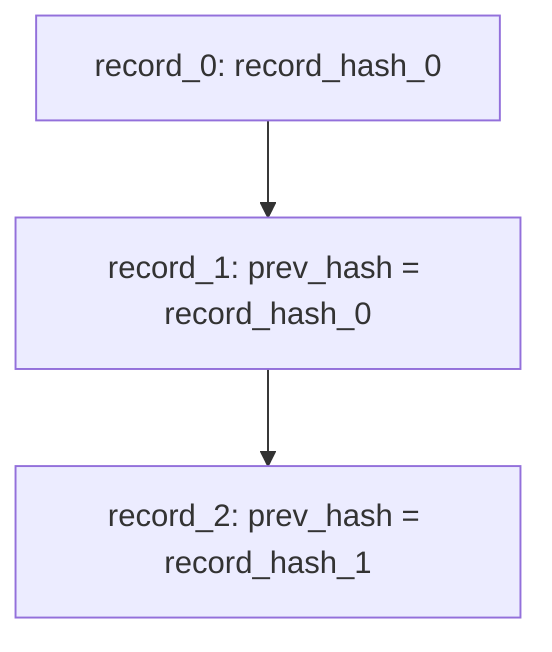

# Append-only ledger semantics

The AIGov Core ledger is an **append-only, hash-chained** event log per deployment (tenant-scoped in hosted and self-host configurations). It is the **system of record** for governance execution.

## Guarantees

| Guarantee | Description |
|-----------|-------------|
| **Append-only** | Accepted events are not updated in place; corrections require new events on the same or new `run_id` per your process |
| **Hash chain** | Each record links to `prev_hash`; tampering breaks verification |
| **Ingest enforcement** | Policy and schema run before append; rejected writes never enter the chain |
| **Deterministic read projection** | Bundle and compliance summary are pure functions of ledger content + `policy_version` |

## Non-guarantees

| Non-guarantee | Implication |
|---------------|-------------|
| Completeness | Events not submitted are not in the chain |
| Actor identity | `actor` fields are only as trustworthy as your submission controls |
| External system fidelity | Ledger does not prove production matches described model weights |
| Immutable storage media | Operator must protect volumes; WORM and backups are customer/operator controls |

## Record model (conceptual)

Verification endpoints:

- `GET /verify` / `GET /verify-log` — chain integrity for stored log
- `GET /bundle-hash` — content hashes for CI artefact binding

## Source-of-truth chain

Aligned with [strong-core-contract-note.md](../strong-core-contract-note.md):

1. Immutable ledger (`POST /evidence`)
2. Bundle document (`GET /bundle`)
3. `ComplianceCurrentState` projection
4. `GET /compliance-summary` API contract

No Platform table participates in step 1–4.

## Tenant scoping

Ledger files and API keys map to `tenant_id` server-side. Client project headers are attribution metadata, not the isolation boundary. Architecture view: [tenant-isolation-architecture.md](tenant-isolation-architecture.md). Security detail: [../security/tenant-isolation.md](../security/tenant-isolation.md).

## Operational durability

Backup, replication, encryption at rest, and legal hold are **operator responsibilities** documented in [../security/audit-ledger-security.md](../security/audit-ledger-security.md) and [../trust/shared-responsibility-model.md](../trust/shared-responsibility-model.md).
