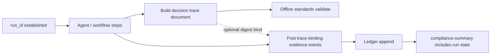

# Decision trace lifecycle

A **decision trace** documents multi-step AI or agent activity (tools, delegations, intermediate outcomes) for review and interchange. In GovAI vocabulary it is distinct from the **compliance verdict** but can be bound to the same `run_id` through audit evidence.

## Concepts

| Term | Definition |
|------|------------|
| **Decision trace** | Portable `governance_decision_trace` artefact (see [../standards/registry.md](../standards/registry.md)) |
| **Audit evidence** | Ledger events accepted via `POST /evidence` |
| **Compliance verdict** | `VALID` / `INVALID` / `BLOCKED` from `GET /compliance-summary` |

Validating a trace file offline proves **structural conformance and digest stability**. It does **not** prove the trace was appended to your production ledger or that the run is `VALID`.

## Lifecycle

| Stage | Owner | Notes |
|-------|-------|-------|
| 1. Allocate `run_id` | Integrator | Same id across evidence and trace |
| 2. Execute decision path | Application | Tools, models, human steps |
| 3. Capture trace | Integrator or exporter | JSON per interchange spec |
| 4. Validate offline | `govai standards` / CI | Deterministic validators |
| 5. Bind to governance | Evidence events referencing trace digest or step outcomes | Required for hosted authority |
| 6. Review verdict | Auditor | Summary authoritative; trace is supporting detail |
| 7. Export bundle | `GET /api/export` + optional trace file in evidence pack | Chain-of-custody to GRC |

## Trace verification plans

Multi-agent deployments may use **trace verification plans** (standards schema) to declare required steps and digests. Failures surface as standards findings (`TRACE_DIGEST_REQUIRED`, etc.) in offline tooling — separate from HTTP `BLOCKED` unless your policy maps them via evidence requirements.

## Export semantics

| Export channel | Contents |
|----------------|----------|
| `GET /api/export/:run_id` | Ledger-derived audit JSON, verdict, hashes |
| Evidence pack | Manifest linking artefacts, bundle digests, optional trace file |
| Regulator Markdown | Themed narrative from regulatory manifests — indicative, not legal sign-off |

## Replay interaction

Audit replay reproduces **verdict from ledger + policy**. If a decision trace file is included in a pack, replay also checks **digest continuity** between pack manifest and recorded events. Trace-only replay without ledger binding is a **standards check**, not a governance verdict replay.

See [diagrams/audit_replay_architecture.md](diagrams/audit_replay_architecture.md).

## Related

- [../standards/interchange-specification.md](../standards/interchange-specification.md)
- [evidence-lifecycle.md](evidence-lifecycle.md)
- [governance-semantics.md](governance-semantics.md)
