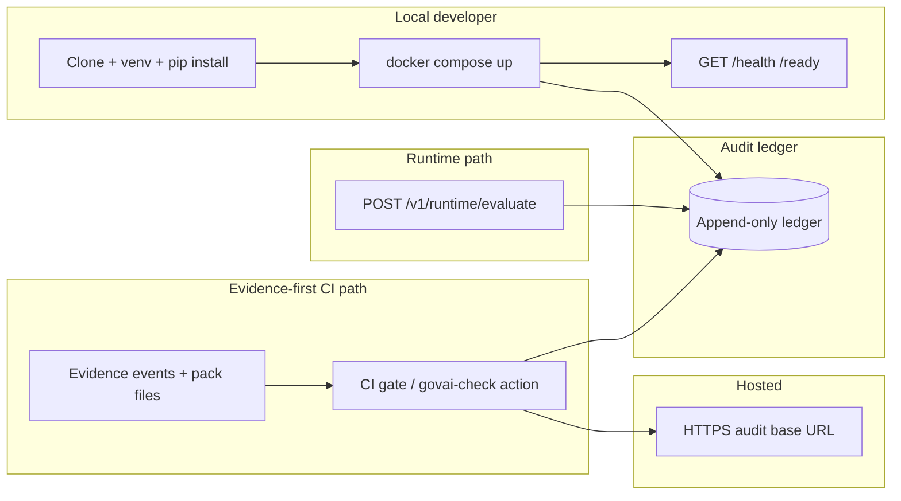

# Developer onboarding flow (architecture view)

How a contributor moves from **clone** to **local run**, and how that relates to **runtime evaluate**, **evidence packs**, **CI gates**, the **audit ledger**, and **hosted** audit URLs — without duplicating full tutorials (links point to canonical docs).

## Flow (Mermaid)

## Clone → local run

Follow **[docs/project/local_development.md](../project/local_development.md)** for exact commands (venv under `python/`, `docker compose`, `make gate`, `cargo test`, `pytest`).

## Runtime evaluate

- **HTTP:** `POST /v1/runtime/evaluate` — see **[api/govai-http-v1.openapi.yaml](../../api/govai-http-v1.openapi.yaml)** and **[governance/runtime_integration.md](../governance/runtime_integration.md)**.
- **Verdicts** in governance overlays use **`VALID` / `INVALID` / `BLOCKED`** vocabulary where applicable; **advisory** rows (for example **`advisory_control_evaluations`**, **`source: capability_shadow`**) are **not** a substitute for ledger promotion or **`GET /compliance-summary`** gating.

## Evidence pack

Customer and CI flows produce **`evidence_digest_manifest.json`** + **`<run_id>.json`**; semantics and CLI are in **[evidence-pack.md](../evidence-pack.md)** and **[github-action.md](../github-action.md)**.

## CI gate

- **This repository’s** production-style merge gate is **`.github/workflows/compliance.yml`** (artefact-bound path documented in `docs/github-action.md`).
- **Downstream** minimal workflow copy lives at **`examples/ci/govai-check.yml`**.

## Audit ledger

Append-only evidence and decisions are stored server-side; **tenant isolation** follows **server-side API key mapping** (not `X-GovAI-Project` alone). See **[SECURITY.md](../../SECURITY.md)** and **[trust-model.md](../trust-model.md)**.

## Hosted audit URL

Operators configure a public **audit base URL** (for example **`GOVAI_AUDIT_BASE_URL`** in CI variables). Subdomain and deployment notes: **[hosted-audit-subdomain.md](../hosted-audit-subdomain.md)**, **[hosted-backend-deployment.md](../hosted-backend-deployment.md)**.

## Deeper reading

- Architecture overview: [overview.md](overview.md)
- High-level diagram: [diagrams/high_level_architecture.md](diagrams/high_level_architecture.md)
