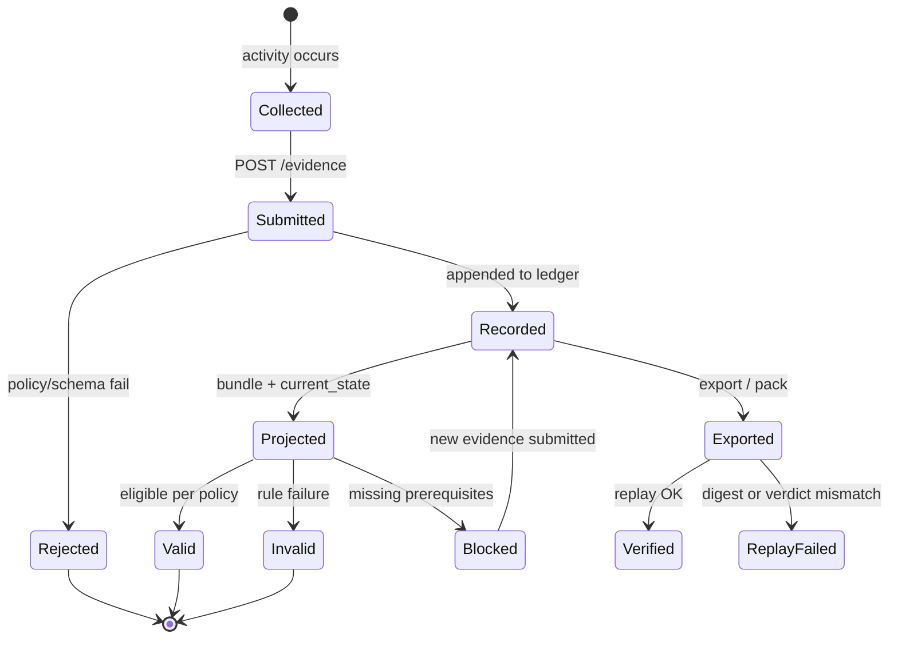

# Evidence lifecycle

The evidence lifecycle describes how governance-relevant facts become **audit evidence**, how they are protected in the ledger, and how they surface in **compliance verdicts** and exports.

Canonical diagram: [diagrams/evidence_lifecycle.md](diagrams/evidence_lifecycle.md).

## Lifecycle stages

| # | Stage | Description |
|---|-------|-------------|
| 1 | **Source activity** | Training, evaluation, approval, promotion, runtime action, discovery |
| 2 | **Collection** | SDK, CLI, or HTTP client gathers typed payloads |
| 3 | **Normalization** | Events conform to schema; `run_id`, `policy_version`, identifiers attached |
| 4 | **Ingest** | `POST /evidence`; policy enforced before append |
| 5 | **Ledger persistence** | Append-only, hash-chained record per tenant |
| 6 | **Projection** | Bundle and `ComplianceCurrentState` derived on read |
| 7 | **Verdict** | `GET /compliance-summary` → `VALID` / `INVALID` / `BLOCKED` |
| 8 | **Export** | `GET /api/export/:run_id`, evidence packs, regulator-oriented bundles |
| 9 | **Verification / replay** | Offline digest check and verdict reproduction |

## Evidence vs explanation

| Term | Meaning |
|------|---------|
| **Audit evidence** | Typed events accepted into the ledger |
| **Compliance projection** | Derived `current_state` in summary |
| **Audit export** | Stable JSON including hashes and verdict fields |
| **Explanation** | Human-readable narrative; not authoritative unless backed by evidence |

GovAI does not invent missing evidence. **BLOCKED** indicates the run cannot be promoted under policy until required events exist.

## Integrity checkpoints

| Checkpoint | Mechanism |
|------------|-----------|
| Ingest | Schema validation + `policy.rs` |
| Storage | Hash chain per tenant log |
| CI binding | `events_content_sha256` vs built artefacts |
| Offline pack | `govai verify-evidence-pack` |
| Replay | Recompute verdict; compare to recorded |

## Discovery-augmented requirements

Discovery signals (`ai_discovery_reported`) can increase **required evidence** with `source: discovery`. A run may be **BLOCKED** solely for missing discovery-derived items even when base checklist items exist ([trust-model.md](../trust-model.md)).

## Related

- [append-only-ledger-semantics.md](append-only-ledger-semantics.md)
- [governance-semantics.md](governance-semantics.md)
- [policy-evaluation-lifecycle.md](policy-evaluation-lifecycle.md)
