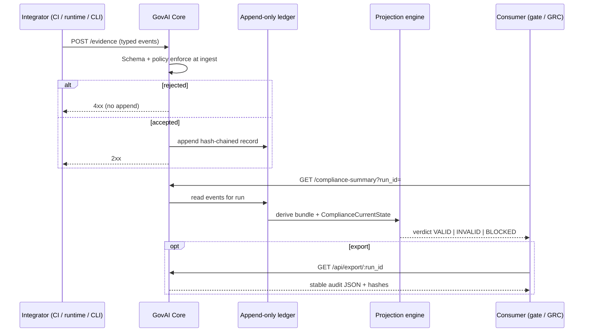

# Governance execution flow

**Governance execution** is the end-to-end path from integrator activity to an authoritative **compliance verdict** and optional export. This is distinct from Platform workflow UI or operational telemetry.

## End-to-end flow

## Execution stages

| Stage | Responsibility | Failure mode |
|-------|----------------|--------------|
| 1. Emit governance activity | Customer pipelines, agents, operators | No verdict until events submitted |
| 2. Normalize to audit events | SDK / CLI / direct HTTP | Client-side validation errors |
| 3. Ingest and enforce policy | Core `policy.rs` at `POST /evidence` | Request rejected; ledger unchanged |
| 4. Persist evidence | Core ledger per tenant | Startup failure if ledger not writable (`GET /ready` = 503) |
| 5. Project governance state | Core read path | `ok: false` in summary if load/projection error |
| 6. Publish verdict | `GET /compliance-summary` | **BLOCKED** if prerequisites missing |
| 7. Gate or release | Customer CI / change management | Exit code or API check on verdict |
| 8. Export and replay | Customer or auditor | Independent verify/replay |

## CI governance execution

Typical CI path:

1. Train or build produces artefacts and evaluation evidence.
2. Pipeline posts lifecycle events (`evaluation`, approvals, promotion candidates).
3. `govai check` or GitHub Action calls `GET /compliance-summary`.
4. Non-`VALID` fails the job (exit code **3** for `BLOCKED`, **2** for `INVALID` in CLI conventions — see [../cli-reference.md](../cli-reference.md)).
5. Optional: bind artefact digests via `GET /bundle-hash` before deploy.

Diagram: [diagrams/ci_cd_compliance_flow.md](diagrams/ci_cd_compliance_flow.md).

## Runtime governance execution

After deployment, integrators may:

- Continue posting evidence for operational runs
- Call preview runtime evaluate for advisory signals (does not replace summary)
- Block customer traffic when summary is not `VALID` if their policy wires runtime gates to the same `run_id`

Runtime enforcement is **customer policy wiring** to Core verdicts; Core does not automatically intercept model APIs unless you integrate it.

Diagram: [diagrams/runtime_governance_flow.md](diagrams/runtime_governance_flow.md).

## Platform overlay (non-authoritative for verdict)

When GovAI Platform is enabled:

1. Team member registers a run in `compliance_workflow` (JWT).
2. Human reviewer approves or rejects in queue UI.
3. Operator must still confirm `GET /compliance-summary` before production promotion if ledger policy is the system of record.

Platform approval **without** matching ledger evidence does not create `VALID`.

## Related

- [governance-semantics.md](governance-semantics.md)
- [platform-vs-core-boundary.md](platform-vs-core-boundary.md)
- [hosted-vs-self-host-topology.md](hosted-vs-self-host-topology.md)
