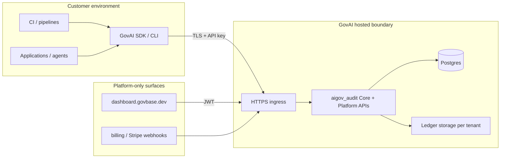
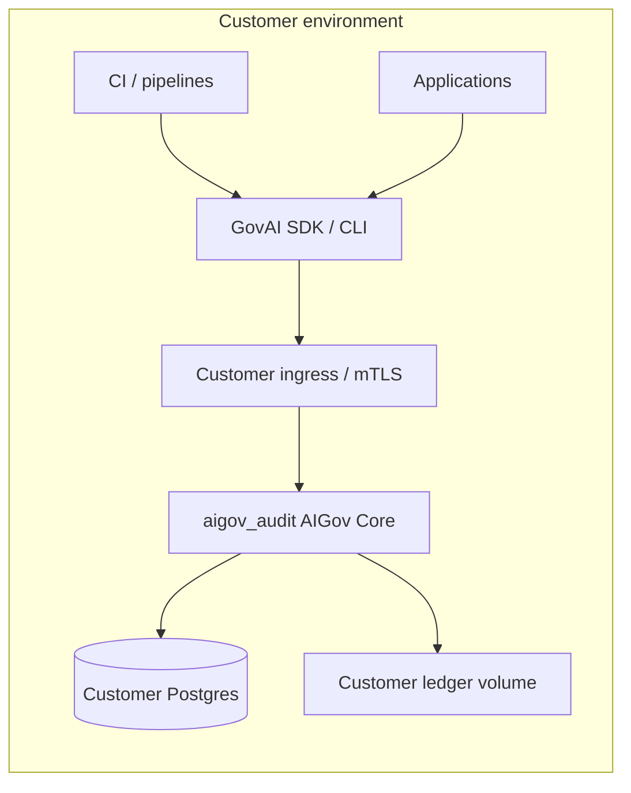

# Hosted vs self-host deployment topology

Enterprise architects need a single view of **who operates what**, **where evidence lives**, and **which URLs and credentials apply**.

## Deployment modes

| Mode | Who operates the audit runtime | Typical Postgres / ledger | Customer integration |
|------|--------------------------------|---------------------------|----------------------|
| **Hosted Professional** | GovAI Platform (operator) | Operator-managed, tenant-scoped | `GOVAI_AUDIT_BASE_URL` → hosted HTTPS origin; API keys from onboarding |
| **Enterprise (self-host Core)** | Customer platform team | Customer-managed | Same Core routes on customer ingress; customer secrets and backups |
| **Hybrid** | Customer runs Core; Platform dashboard optional | Split per contract | Core in VPC; Platform SaaS for workflow only if purchased |

Both modes use the **same Core semantics**: `POST /evidence`, `GET /compliance-summary`, export and replay contracts do not change because the operator changes.

## Topology — hosted (Platform-operated runtime)

**Customer controls:** evidence submission from their systems, policy configuration they adopt, CI gate thresholds, retention of exported bundles in their artefact stores.

**GovAI Platform controls (hosted):** ingress availability, API key provisioning UI, metering, Stripe webhooks when enabled, operator backups and migration discipline documented in [hosted-backend-deployment.md](../hosted-backend-deployment.md).

**Evidence location:** Authoritative ledger records and projections are stored in the **operator environment** behind the hosted audit URL. Customers receive **exports and digests**; they should treat exported bundles as their chain-of-custody copy for audits.

## Topology — self-host (customer-operated Core)

**Customer controls:** entire runtime boundary — network policy, `GOVAI_API_KEYS_JSON`, Postgres HA, ledger backups, `GET /ready` probes, secret rotation, WAF, and DR.

**GovAI Platform controls:** none on the runtime unless a separate Platform subscription is in force (for example dashboard-only).

Deploy checklist: [hosted-backend-deployment.md](../hosted-backend-deployment.md) (sections apply to any production Core deployment), [../runtime/deployment-guidance.md](../runtime/deployment-guidance.md), [../security/secure-deployment-checklist.md](../security/secure-deployment-checklist.md).

## Trust boundaries summary

| Asset | Hosted | Self-host |
|-------|--------|-----------|
| API keys | Issued via Platform onboarding; mapped server-side to `tenant_id` | Customer-generated; same mapping mechanism |
| Ledger integrity | Operator storage + customer export copies | Customer storage + customer export copies |
| Compliance verdict authority | `GET /compliance-summary` on hosted origin | Same route on customer origin |
| Workflow queue (`/api/*`) | Optional Platform feature | Optional; requires customer-operated Platform stack or omitted |
| Billing / metering | Platform Stripe integration | Customer responsibility unless contracted |

## Operational probes (both modes)

- **Liveness after startup:** `GET /health` (process up; not a substitute for dependency readiness)
- **Readiness for traffic:** `GET /ready` (Postgres, migrations, ledger writable)

Do not point load balancers only at `/health` when Postgres or ledger failure must stop traffic — see [../security/security-overview.md](../security/security-overview.md).

## Shared responsibility

Detailed RACI-style expectations: [../trust/shared-responsibility-model.md](../trust/shared-responsibility-model.md).
