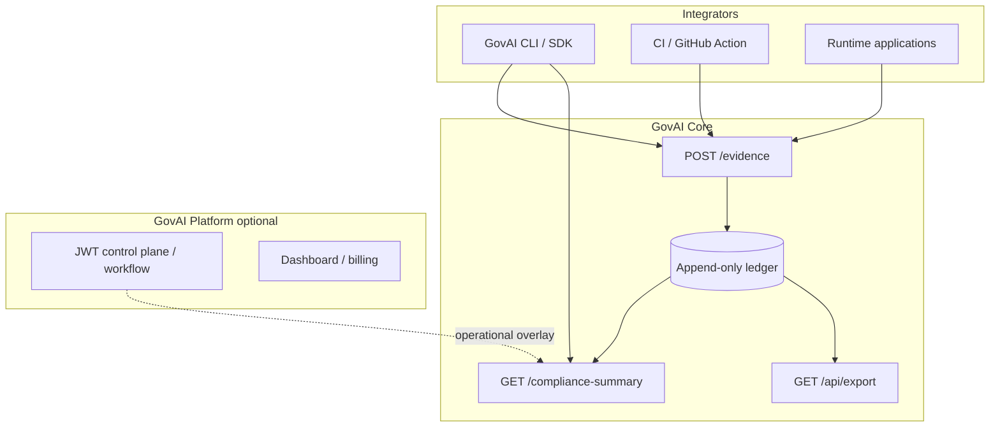

# GovAI architecture overview

GovAI is **evidence-grade AI governance infrastructure** for regulated and high-assurance AI deployments. It records **audit evidence**, evaluates **policy** at ingest, and exposes one authoritative **compliance verdict** per run (`VALID`, `INVALID`, or `BLOCKED`).

Enterprise architecture hub (full map): **[README.md](README.md)**. Canonical terms: **[../terminology.md](../terminology.md)**.

## Product architecture

GovAI ships as two cooperating products:

| Product | Responsibility |
|---------|----------------|
| **GovAI Core** | Append-only ledger, policy enforcement, compliance projection, export and replay |
| **GovAI Platform** | Hosted SaaS, billing, onboarding, dashboard, enterprise control plane (`/api/*`) |

Boundary detail: [platform-vs-core-boundary.md](platform-vs-core-boundary.md). Deployment modes: [hosted-vs-self-host-topology.md](hosted-vs-self-host-topology.md).

## Architectural layers

| Layer | Function | Authoritative for verdict? |
|-------|----------|---------------------------|
| **Integrators** | Submit evidence; consume summary and exports | No |
| **GovAI Core** | Ingest, ledger, policy, projection, verdict | **Yes** |
| **GovAI Platform** | Teams, workflow queue, hosted operations | No (must reconcile with summary) |
| **Customer GRC** | Long-term export archive, legal process | No |

## Core concepts

### Decision-centric governance execution

GovAI evaluates whether a **run** is governable and auditable under a declared `policy_version`:

- Required **audit evidence** present or **BLOCKED**
- Decisive rules satisfied or **INVALID**
- Integrity and digests consistent or verification failure

This is not model-quality observability. Metrics and dashboards around runtime ([../observability/README.md](../observability/README.md)) are **operational aids** and do not replace the compliance verdict.

### Fail-closed semantics

Formal definition: [governance-semantics.md](governance-semantics.md). Concise reference: [../trust-model.md](../trust-model.md).

### Evidence continuity

Lifecycle: [evidence-lifecycle.md](evidence-lifecycle.md). Ledger rules: [append-only-ledger-semantics.md](append-only-ledger-semantics.md).

## Lifecycles (where to read)

| Lifecycle | Document |
|-----------|----------|
| Evidence | [evidence-lifecycle.md](evidence-lifecycle.md) |
| Policy evaluation | [policy-evaluation-lifecycle.md](policy-evaluation-lifecycle.md) |
| Decision trace | [decision-trace-lifecycle.md](decision-trace-lifecycle.md) |
| Governance execution | [governance-execution-flow.md](governance-execution-flow.md) |

## Main components

### Rust audit service (GovAI Core)

- `POST /evidence` — ingest with policy enforcement
- `GET /compliance-summary` — authoritative compliance verdict
- `GET /bundle`, `GET /bundle-hash`, `GET /verify*` — integrity and CI binding
- `GET /api/export/:run_id` — stable audit export

Implementation: [../../ARCHITECTURE.md](../../ARCHITECTURE.md). Contract note: [../strong-core-contract-note.md](../strong-core-contract-note.md).

### Python SDK / CLI

- Governance execution helpers, evidence packs, replay, CI gates
- Does not define a second verdict channel

### Policy engine

Evaluated at ingest (`policy.rs`) and on projection read. See [policy-evaluation-lifecycle.md](policy-evaluation-lifecycle.md).

### CI/CD integration

GitHub Action and `govai check` consume `GET /compliance-summary`. Diagram: [diagrams/ci_cd_compliance_flow.md](diagrams/ci_cd_compliance_flow.md).

### Runtime integration

Preview `POST /v1/runtime/evaluate` is advisory; summary verdict remains authoritative. See [../runtime/overview.md](../runtime/overview.md).

## Tenant isolation

Server-side API key → `tenant_id` mapping for ledger routes. Architecture: [tenant-isolation-architecture.md](tenant-isolation-architecture.md). Security: [../security/tenant-isolation.md](../security/tenant-isolation.md).

## Deployment model

| Mode | Documentation |
|------|----------------|
| Hosted Professional | [../hosted-backend-deployment.md](../hosted-backend-deployment.md), [hosted-vs-self-host-topology.md](hosted-vs-self-host-topology.md) |
| Self-host Enterprise | Same Core routes; customer-operated boundary |
| Local development | [developer_onboarding_flow.md](developer_onboarding_flow.md) |

## HTTP surface

Normative API: [`api/govai-http-v1.openapi.yaml`](../../api/govai-http-v1.openapi.yaml). Reader summary: [../api-reference.md](../api-reference.md).

**Auth split:** API keys for ledger routes; Supabase JWT + team header for Platform `/api/*`.

## Enterprise trust and regulatory context

| Topic | Document |
|-------|----------|
| Trust package | [../trust/enterprise-trust-package.md](../trust/enterprise-trust-package.md) |
| Shared responsibility | [../trust/shared-responsibility-model.md](../trust/shared-responsibility-model.md) |
| EU AI Act (indicative) | [../regulatory/ai-act-enterprise-positioning.md](../regulatory/ai-act-enterprise-positioning.md) |

## Shipped vs preview

| Status | Area |
|--------|------|
| **Shipped** | Evidence → ledger → summary / export / replay |
| **Shipped** | CLI, GitHub Action, standards offline validators |
| **Preview** | `POST /v1/runtime/evaluate` |
| **Roadmap** | Multi-region DR, extended immutability options — [../roadmap.md](../roadmap.md) |
