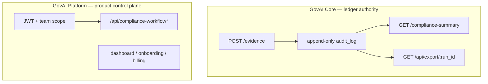

# GovAI Platform vs GovAI Core

GovAI is delivered as two cooperating products. Confusing them breaks procurement reviews, threat models, and integration design.

## GovAI Core (portable audit runtime)

**GovAI Core** is the regulation-agnostic **audit runtime** and contract surface:

- Append-only, hash-chained evidence ledger (`POST /evidence`)
- Policy enforcement at ingest (`policy.rs` on accepted events)
- Deterministic projection: ledger → bundle → `ComplianceCurrentState` → **`GET /compliance-summary`**
- Authoritative **compliance verdict** per run: `VALID`, `INVALID`, or `BLOCKED`
- Stable audit export (`GET /api/export/:run_id`) and offline replay semantics
- Portable standards validators and interchange shapes (offline; do not replace ledger authority)

**Stability expectation:** Core HTTP contracts and verdict semantics are intentionally versioned. Integrators who need only governance execution and audit evidence should depend on Core routes and [strong-core-contract-note.md](../strong-core-contract-note.md), not on Platform-only APIs.

**Self-host boundary:** Customers may operate Core in their own environment (container or host-native `aigov_audit`) with operator-owned Postgres and ledger storage. GovAI does not need to operate the runtime for Core semantics to apply.

Canonical implementation reference: [ARCHITECTURE.md](../../ARCHITECTURE.md), [ENTERPRISE_LAYER.md](../../ENTERPRISE_LAYER.md) (what Core explicitly does *not* include).

## GovAI Platform (proprietary control plane and hosted SaaS)

**GovAI Platform** is the proprietary product layer:

- Hosted audit endpoints and production topology ([hosted-backend-deployment.md](../hosted-backend-deployment.md))
- Tenant onboarding, API key lifecycle, Stripe billing and metering
- Dashboard and operator UX (`dashboard/`)
- Enterprise control plane: JWT-scoped `/api/*`, teams, assessments, **`compliance_workflow`** queues
- Commercial packaging: **Hosted Professional**, **Enterprise**, **Strategic Advisory** (see [pricing/index.md](../pricing/index.md))

**Critical boundary:** Platform workflow rows and JWT product APIs **do not** append to the immutable ledger and **do not** replace `policy.rs` or redefine the compliance verdict. Operational sign-off in Platform must be **reconciled** with `GET /compliance-summary` ([strong-core-contract-note.md](../strong-core-contract-note.md)).

## Control plane vs runtime (same deployment, different trust)

Many deployments run **one Rust binary** with both surfaces merged at the router. The split is **semantic**, not a requirement for separate processes:

| Concern | GovAI Core | GovAI Platform |
|---------|------------|----------------|
| Writes hash-chained evidence | Yes | No |
| Defines promotion eligibility (`VALID` / `BLOCKED`) | Yes (via projection) | No (workflow may block operationally only) |
| Tenant isolation for ledger routes | API key → tenant mapping | Same keys; plus team RBAC for `/api/*` |
| Auth for governance verdict | API key (hosted/self-host) | N/A — verdict is Core |
| Auth for workflow queue | N/A | Supabase JWT + `x-govai-team-id` |

## SDK and integrator relationship

| Surface | Bound to | License / distribution |
|---------|----------|-------------------------|
| Python CLI / `aigov-py`, TypeScript SDK | Core HTTP contracts | Published from **govai-core** open runtime repository |
| GitHub Action (composite) | Core gates and evidence paths | Same |
| Dashboard, hosted billing, enterprise `/api/*` | Platform | Proprietary; this platform repository |

Integrators building **governance execution** in CI or runtime should target Core. Teams buying **hosted operations and enterprise workflow** add Platform.

## What neither product claims

- Legal or regulatory **certification** from software alone
- Completeness of all events that occurred in your organization
- Truthfulness of model outputs or runtime behavior outside recorded evidence

See [governance-semantics.md](governance-semantics.md) and [../trust/enterprise-trust-package.md](../trust/enterprise-trust-package.md).
