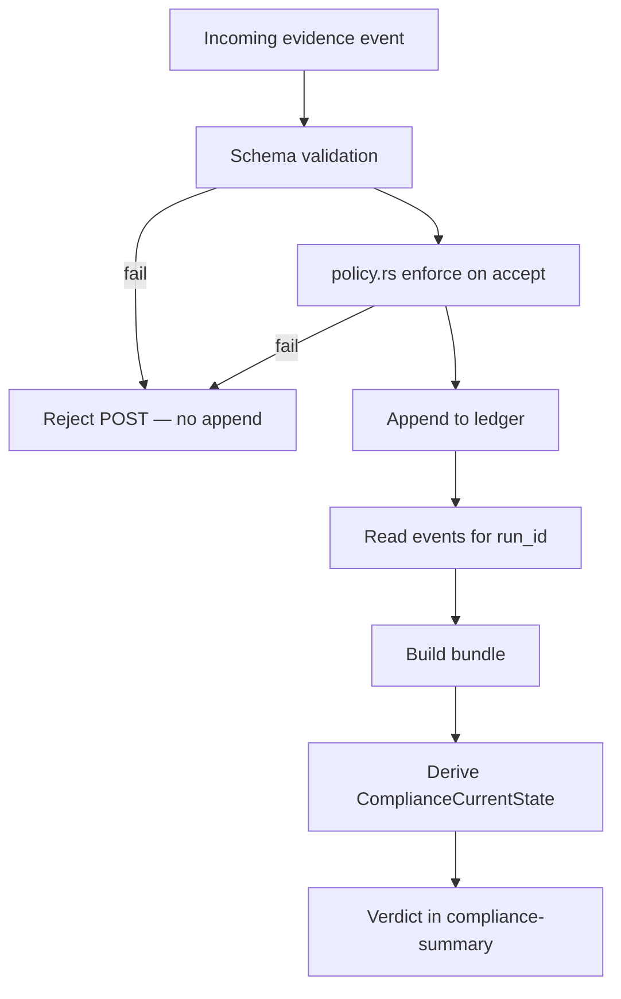

# Policy evaluation lifecycle

**Policy evaluation** in GovAI Core occurs at **evidence ingest** and again implicitly during **projection** when building the compliance summary. There is no separate hidden policy engine that can override ledger facts.

## Lifecycle

## Policy version

| Concept | Behavior |
|---------|----------|
| `policy_version` | Immutable label for which rule set applied at ingest and projection |
| Change mid-run | New requirements may apply to subsequent events; summary reflects current policy version in response |
| Determinism | Same events + same `policy_version` → same projection fields and verdict |

Customers must treat `policy_version` bumps as **contract changes** in CI and release management.

## Evaluation types

| Type | When evaluated | Verdict impact |
|------|----------------|----------------|
| **Required evidence** | Projection compares required vs provided | **BLOCKED** if missing |
| **Decisive rules** | Evaluation pass/fail, capability constraints | **INVALID** when evidence present but rule fails |
| **Approval / promotion** | Approval events and blocked_reasons | **BLOCKED** until satisfied |
| **Discovery-derived** | Signals → additional required items | **BLOCKED** until satisfied |

## Policy evaluation events vs verdict

| Output | Authoritative? |
|--------|----------------|
| HTTP 4xx on `POST /evidence` | Ingest rejection (no ledger write) |
| `GET /compliance-summary.verdict` | **Yes** for promotion eligibility |
| Advisory runtime evaluate overlays | **No** |
| Platform workflow status | **No** for ledger semantics |

## Diagram reference

[diagrams/policy_engine_flow.md](diagrams/policy_engine_flow.md)

## Related

- [governance-semantics.md](governance-semantics.md)
- [governance-execution-flow.md](governance-execution-flow.md)
- [../strong-core-contract-note.md](../strong-core-contract-note.md)
