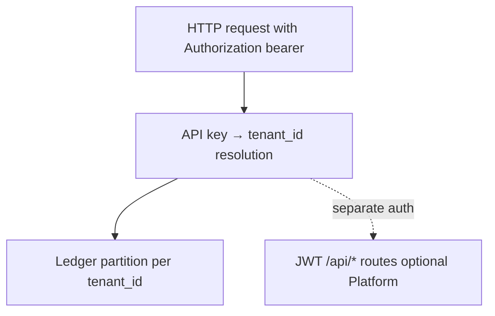

# Tenant isolation (architecture)

Enterprise deployments require predictable **data and ledger isolation** between customers or internal business units. GovAI enforces tenant boundaries on **ledger-backed routes** through **server-side credential mapping**, not through client-selected labels alone.

## Isolation model

| Layer | Mechanism | Security boundary? |
|-------|-----------|-------------------|
| **Ledger routes** | `GOVAI_API_KEYS_JSON` or equivalent map | **Yes** — defines tenant for evidence and summary |
| **Project header** | `X-GovAI-Project` | **No** — usage attribution only |
| **Platform `/api/*`** | Supabase JWT + `x-govai-team-id` + RBAC | **Yes** for product data; separate from ledger append |

## Principles

1. **Server-owned boundaries** — Never treat tenant id from an unauthenticated header as authoritative.
2. **Layered controls** — Combine network policy (VPC, private link), secrets management, and application mapping.
3. **Fail-closed governance** — Cross-tenant evidence submission must be rejected at ingest, not silently merged.

## Hosted vs self-host

| Mode | Who configures mapping |
|------|------------------------|
| Hosted Professional | Platform onboarding issues keys; operator maintains JSON map |
| Self-host Enterprise | Customer platform team rotates keys and map |

Both use the same Core semantics.

## Machine-readable models

Enterprise isolation vocabulary is also described in repository manifests under `multi-tenant/` (index: [../multi-tenant/overview.md](../multi-tenant/overview.md)). Validators do not change verdict semantics.

## Related security documentation

- [../security/tenant-isolation.md](../security/tenant-isolation.md)
- [diagrams/tenant_isolation_model.md](diagrams/tenant_isolation_model.md)
- [hosted-vs-self-host-topology.md](hosted-vs-self-host-topology.md)
