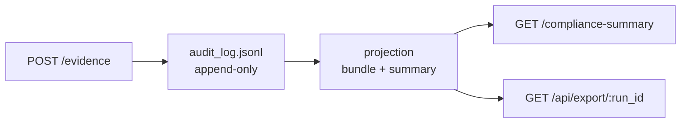
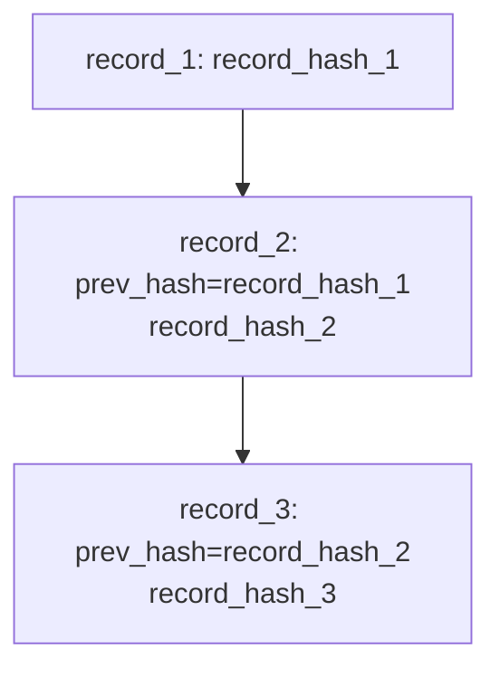

# Trust and explainability (minimal)

This page defines what GovAI claims (and does not claim) about compliance decisions. It underpins the **Governance model** topic in public docs ([govbase.dev/docs/governance-model](https://govbase.dev/docs/governance-model)) and links from [api-reference.md](api-reference.md) and [cli-reference.md](cli-reference.md).

GovAI’s **only authoritative decision** for a run is the response from:

- `GET /compliance-summary?run_id=<id>`

Everything else (CLI output, UI, workflow rows, copied JSON files) is a consumer of that response.

The response is a projection derived from the append-only evidence log.

```docs
preset: governance-decision
```

```docs
preset: verdict-flow
```

---

## Terms

### `VALID`

`VALID` means:

- the server evaluated the run using the configured `policy_version`, and
- **no required evidence is missing**, and
- the evaluated policy rules are satisfied (for example, an evaluation gate did not fail).

Operational meaning: a CI gate that blocks on non-`VALID` can proceed.

`VALID` does not imply correctness of model outputs.

`VALID` is a statement about process compliance, not outcome quality.

### `BLOCKED`

`BLOCKED` means:

- the run is **not eligible for promotion** under the current policy (so the server cannot declare it `VALID`).

Typical symptoms in `GET /compliance-summary`:

- `missing_evidence` is non-empty (structured), and/or
- `blocked_reasons` explains unmet approval/promotion prerequisites (even when `missing_evidence` is `[]`), and/or
- legacy `missing` fields indicate missing items.

Operational meaning: deployment is halted until the run becomes eligible (missing evidence and/or approval/promotion prerequisites are satisfied for the same run).

### `INVALID`

`INVALID` means:

- the server has enough evidence to evaluate at least one decisive policy rule, and
- a policy rule fails (for example `evaluation_passed == false`), even if all required evidence items exist.

Operational meaning: deployment is rejected unless the run is reworked and a new run is created with new evidence.

---

## Evidence

### What “evidence” is

In GovAI, **evidence** is a sequence of structured events submitted to:

- `POST /evidence`

Accepted events are appended to an **append-only, hash-chained** log and later projected into:

- `GET /bundle?run_id=<id>` (bundle view)
- `GET /compliance-summary?run_id=<id>` (decision + state)
- `GET /api/export/<run_id>` (stable audit export)

Evidence is not arbitrary data. Evidence is a typed, schema-valid, policy-relevant event accepted by the system via `POST /evidence`.

Evidence is **not** an explanation generated by the system. It is recorded input facts (events) plus derived projections.

### What “required evidence” means

GovAI distinguishes:

- **provided evidence**: what has been accepted into the run’s evidence log
- **required evidence**: what the current policy requires for the run to become eligible for `VALID`
- **missing evidence**: required evidence items that are not yet provided for the run

In the compliance summary model, required/missing evidence can be represented as structured items with:

- `code`: a stable identifier for the requirement
- `source`: where the requirement came from (for example `discovery`)

Important: “required evidence” is **policy-defined**. It can change when `policy_version` changes.

---

## How AI discovery affects compliance

GovAI can derive additional evidence requirements from **AI discovery signals** recorded into the evidence ledger.

Mechanism (minimal):

- A run reports discovery signals via an evidence event (for example `ai_discovery_reported`).
- The compliance projection derives **discovery signals** from the run’s events.
- From those signals, the projection derives **additional required evidence** items (with `source: discovery`).

Effect:

- A run can be `BLOCKED` solely because discovery-derived requirements are missing.
- Discovery can increase the set of required evidence items compared to a “no discovery findings” run.

What discovery is (and is not):

- It is an input into the requirements model (a signal that can trigger requirements).
- It is not a proof that a given library/model is truly used at runtime; it is a reported/detected signal that drives policy requirements.
- Discovery is heuristic and may produce false positives or miss systems.

---

## Hash chaining and auditability

GovAI stores accepted evidence as an append-only sequence of records, each linking to the previous record via a hash.

Minimal property:

- **If a record in the middle of the log is modified or removed, chain verification fails.**

This supports auditability by making tampering detectable, assuming you retain an authoritative copy of the log (or exported run) for comparison.

Hash chaining guarantees integrity of recorded events, not completeness of recorded events.

Endpoints and artifacts commonly used:

- `GET /verify` / `GET /verify-log`: verifies the integrity of the stored chain
- `GET /api/export/<run_id>`: emits a stable JSON export that includes decision fields and hashes

Diagram (conceptual; not a protocol spec):



Hash chain sketch:



---

## Trust boundary

GovAI guarantees:

- integrity of recorded events
- deterministic evaluation given inputs

GovAI does NOT guarantee:

- completeness of recorded events
- correctness of external system behavior

---

## What the system does not prove (do not overstate)

GovAI does **not** prove any of the following:

- **Truthfulness of inputs or outputs**: it does not verify truthfulness of submitted inputs or of produced outputs.
- **Identity of actors**: unless your deployment enforces authenticated submission and you audit those controls externally, the event `actor` field is not a strong identity claim.
- **Completeness of recorded events**: it does not guarantee that all relevant events were recorded.
- **Runtime behavior**: it does not prove the deployed system matches the described model, dataset, weights, or configuration.
- **Reproducibility of model outputs**: it does not ensure reproducibility of model outputs.
- **Complete AI usage detection**: it does not detect all AI usage; discovery is partial.
- **Absence of side channels**: it does not prove there were no unlogged changes in other systems (artifact stores, training code, infra).
- **Regulatory compliance**: it is not legal certification and does not claim full coverage of any regulation.

What GovAI *does* support, precisely:

- deterministic verdict computation for a run, given the recorded evidence and the `policy_version`
- tamper-evidence for the stored append-only log (hash chaining) and hash-bearing exports

